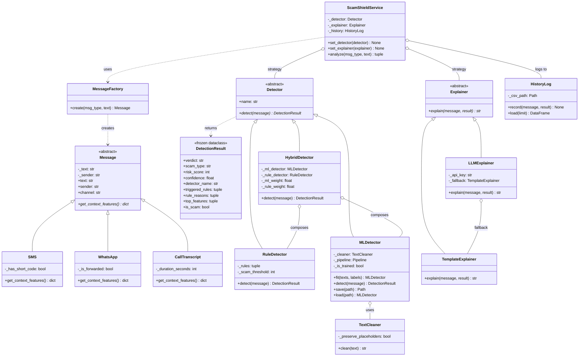

# ScamShield UML Class Diagram

```mermaid
classDiagram
    class Message {
        <<abstract>>
        -_text: str
        -_sender: str
        +text: str
        +sender: str
        +channel: str
        +get_context_features()* dict
    }

    class SMS {
        -_has_short_code: bool
        +get_context_features() dict
    }

    class WhatsApp {
        -_is_forwarded: bool
        +get_context_features() dict
    }

    class CallTranscript {
        -_duration_seconds: int
        +get_context_features() dict
    }

    class MessageFactory {
        +create(msg_type, text) Message
    }

    class DetectionResult {
        <<frozen dataclass>>
        +verdict: str
        +scam_type: str
        +risk_score: int
        +confidence: float
        +detector_name: str
        +triggered_rules: tuple
        +rule_reasons: tuple
        +top_features: tuple
        +is_scam: bool
    }

    class Detector {
        <<abstract>>
        +name: str
        +detect(message)* DetectionResult
    }

    class RuleDetector {
        -_rules: tuple
        -_scam_threshold: int
        +detect(message) DetectionResult
    }

    class MLDetector {
        -_cleaner: TextCleaner
        -_pipeline: Pipeline
        -_is_trained: bool
        +fit(texts, labels) MLDetector
        +detect(message) DetectionResult
        +save(path) Path
        +load(path) MLDetector
    }

    class HybridDetector {
        -_ml_detector: MLDetector
        -_rule_detector: RuleDetector
        -_ml_weight: float
        -_rule_weight: float
        +detect(message) DetectionResult
    }

    class Explainer {
        <<abstract>>
        +explain(message, result)* str
    }

    class TemplateExplainer {
        +explain(message, result) str
    }

    class LLMExplainer {
        -_api_key: str
        -_fallback: TemplateExplainer
        +explain(message, result) str
    }

    class HistoryLog {
        -_csv_path: Path
        +record(message, result) None
        +load(limit) DataFrame
    }

    class TextCleaner {
        -_preserve_placeholders: bool
        +clean(text) str
    }

    class ScamShieldService {
        -_detector: Detector
        -_explainer: Explainer
        -_history: HistoryLog
        +set_detector(detector) None
        +set_explainer(explainer) None
        +analyze(msg_type, text) tuple
    }

    Message <|-- SMS
    Message <|-- WhatsApp
    Message <|-- CallTranscript
    MessageFactory ..> Message : creates

    Detector <|-- RuleDetector
    Detector <|-- MLDetector
    Detector <|-- HybridDetector
    HybridDetector o-- MLDetector : composes
    HybridDetector o-- RuleDetector : composes
    MLDetector o-- TextCleaner : uses
    Detector ..> DetectionResult : returns

    Explainer <|-- TemplateExplainer
    Explainer <|-- LLMExplainer
    LLMExplainer o-- TemplateExplainer : fallback

    ScamShieldService o-- Detector : strategy
    ScamShieldService o-- Explainer : strategy
    ScamShieldService o-- HistoryLog : logs to
    ScamShieldService ..> MessageFactory : uses
```
